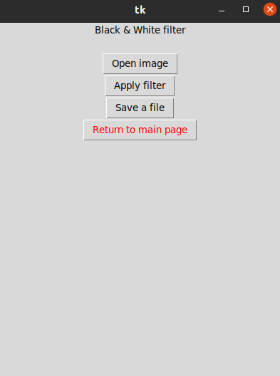
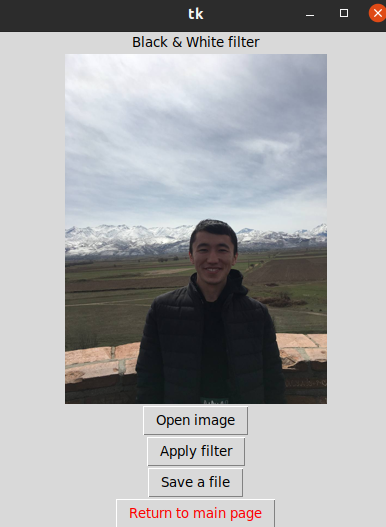
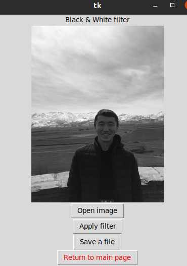
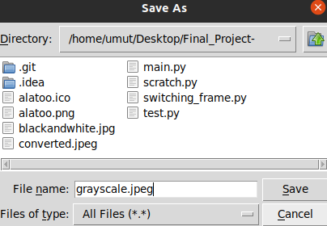
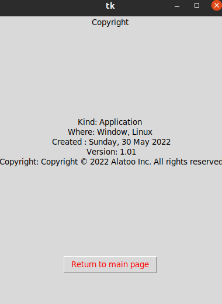

# Python GUI, black&white converter 
> This is simple app that converts your image to black&white filte and save it

## Table of Contents
* [About](#general-information)
* [Requirements](#technologies-used)
* [Screenshots](#screenshots)
* [Setup](#setup)

* [Acknowledgements](#acknowledgements)
* [Contact](#contact)
<!-- * [License](#license) -->

## General Information
- This app converts your image to black&white filter
- The purpose of  project is to make easier to filter images 

## Technologies Used
- Pillow - version 7.0.0
- Tcl/Tk - version 8.6

## Screenshots

## Setup

First clone this repository 
Then install tk with as following 

`pip install tk`

Finally install Pillow library 

`python3 -m pip install --upgrade pip`
`python3 -m pip install --upgrade Pillow`

## Project Status
Project is: _in progress_ 

## Acknowledgements

- This project was based on [this tutorial]([https://www.example.com](https://stackoverflow.com/questions/7546050/switch-between-two-frames-in-tkinter#:~:text=One%20way%20to%20switch%20frames,use%20any%20generic%20Frame%20class.)).

## Contact
Created by [ymytbek0314@gmail.com](https://github.com/Arpidinov)) - feel free to contact me!

